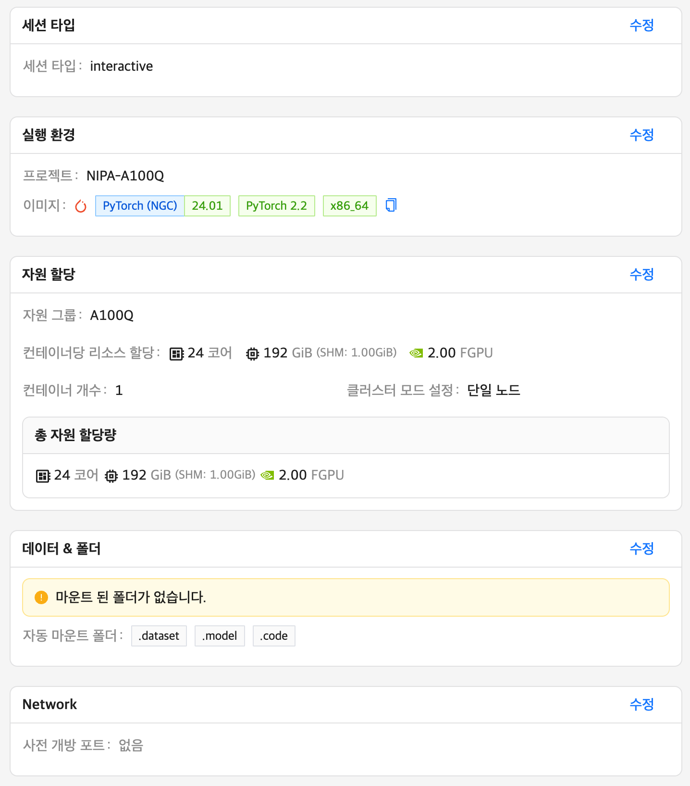
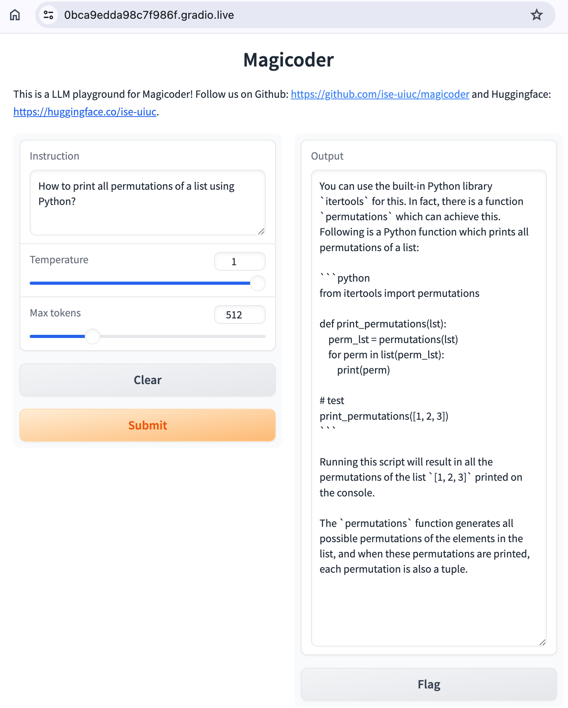
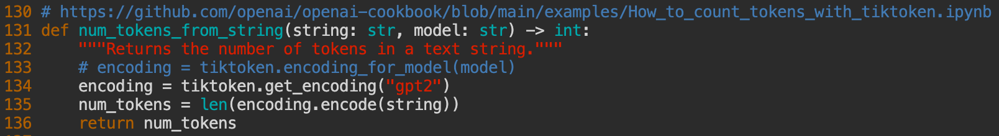
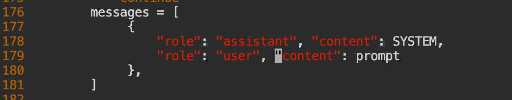
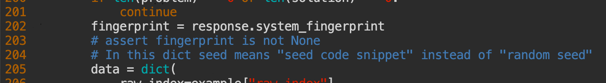
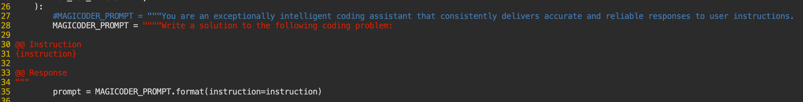

# magicoder-test
- KT Cloud 에서 `Magicoder: Source Code Is All You Need` 레포지토리의 코드를 테스트한 과정을 기록한 문서입니다.
- 대부분의 절차는 이 문서(https://github.com/ise-uiuc/magicoder/blob/main/README-DEV.md)를 참조하였습니다.

## 세션 생성
- 거의 디폴트 설정을 그대로 두되 메인 메모리 등은 할당가능한 최대값으로 하였습니다. (짜투리 남겨 둬봤자 쓸모가 없음)
- 미리 만들어 두었던 `.dataset`, `.model`, `.code` 폴더는 자동 선택되어 세션에 마운트 됩니다.
    

## 개발 환경 접속과 설정
- 콘솔, VS code, Jupyter 등이 무엇으로 해도 별 차이는 없습니다. (본인 편한 것으로 진행)
- (**주의: NFS 폴더로 캐시 폴더를 변경하면 다운로드하면서 file lock에서 먹통이 되는 현상이 있다고 합니다. 만약 그렇다면 `unset HF_HOME`을 하여 export 한 것을 취소하고 캐시 폴더가 너무 커지지 않게 관찰하면서 실행해야 합니다.**) 실행 중 모델이나 데이터셋을 허깅페이스에서 다운로드 받으면 ~/.cache/huggingface 에 저장하여 (루트 파티션이 충분히 크지 않아서) 저장 공간이 부족합니다. 그나마 여유가 있는 폴더로 디폴트 폴더를 변경합니다.
    ```bash
    export HF_HOME='~/.model'
    ```
- 허깅페이스로 로그인을 해둡니다. (로그인에 필요한 접속 토크는 허깅페이스에 회원 가입하여 설정 메뉴에서 생성할 수 있습니다.)
    ```bash
    huggingface-cli login
    ```
- 실행할 코드를 저장할 폴더를 만듭니다.
    ```bash 
    cd .code
    mkdir 4x4
    cd 4x4
    ```

## 레포지토리 가져오고 데모 돌려보기
- 레포지토리에서 코드를 받아온다.
    ```bash
    git clone https://github.com/ise-uiuc/magicoder.git
    cd magicoder/
    ```
- 데모 프로그램을 돌려본다. (안 해보셔도 됨)
    ```bash
    cd demo
    pip install gradio
    pip install -U bitsandbytes
    CUDA_VISIBLE_DEVICES=0 python magicoder_demo.py --base_model "ise-uiuc/Magicoder-S-DS-6.7B" --device "cuda:0" --port 8080
    ```
- 모델이 다운로드가 되고 gradio가 실행되면 이런 메시지가 나오는데 아무데서나 웹 브라우저로 아래의 임시 링크로 접속하면 된다. 프로그래밍 질문을 던져서 잘 푸는지 본다.


## 학습용 데이터셋 생성
- 실행할 소스 코드가 있는 폴더로 이동
    ```bash
    cd ../src
    ```
- 무슨 이유에서인지 prompt.txt 파일을 가져오는 폴더가 짝이 맞지 않아서 복사를 해줍니다.
    ```bash
    cp -r ../data .
    ```
- OpenAI ChatGPT를 이용하여 학습용 데이터 생성하기 (OpenAI에서 결제하고 유료 API 실행을 위한 API 키를 받아야 함. 유료 API를 사용하지 않으려면 아래의 `오픈소스 LLM 모델로 학습용 데이터셋 생성하기`으로 건너뛸 것)
    ```bash
    cd 
    pip install openai
    pip install tiktoken

    export OPENAI_API_KEY=<여기에 OpenAPI 키를 넣을 것>

    # max_new_data 가 생성할 데이터의 수 
    python magicoder/generate_data.py --seed_code_start_index 1 --max_new_data 1   --data_dir python --tag python
    ```
- 실행 결과는 현재 폴더 아래에 `data-python-baa05-1_11-20240602_025904.jsonl` 같은 형태의 JSONL 파일로 만들어 진다. 이 파일을 열어보면 instruct 모델 훈련용 데이터셋을 어떤 형태로 만드는지 알 수 있다. (OpenAI ChatGPT 모델이 얼마나 데이터셋을 그럴듯하게 만들었는지 확인할 것.)

## 오픈소스 LLM 모델로 학습용 데이터셋 생성하기
- vLLM은 오픈소스 LLM을 OpenAI 와 같은 API로 접속할 수 있게 만들어 줍니다. 이를 사용하여 무료 모델을 이용하여 데이터셋을 생성해봅니다.
- vLLM을 설치하고 `Mistral-7B-Instruct-v0.3` 모델을 OpenAI API로 서비스하도록 합니다.
    ```bash
    pip install vllm

    python -u -m vllm.entrypoints.openai.api_server --host 0.0.0.0 --model mistralai/Mistral-7B-Instruct-v0.3
    ```
- 위의 명령을 실행한 터미널에서는 계속 vLLM이 돌아가므로 다른 터미널에서 아래의 내용을 진행합니다. (`tmux`를 사용하고 있다면 `CTRL+B c`로 새로운 세션을 만들면 됩니다. 콘솔 세션간 이동은 `CTRL+B n` 또는 `CTRL+B p`)
- 모델을 변경하는 바람에 인코더를 가져오는 방법을 수정해야 합니다. `magicoder/utils.py` 를 아래와 같이 수정합니다.

- ChatGPT와 Mistral이 사용하는 메시지 포맷이 다르므로 맞춰주기 위해서 `magicoder/generate_data.py`의 해당 부분을 아래와 같이 수정합니다.

- 또한, Mistral에서 fingerprint를 리턴하지 않고 있어서 `magicoder/generate_data.py`에서 이를 체크하는 부분도 막아줍니다.

- 위에서와 마찬가지로 데이터셋 생성용 스크립트를 실행하는데 대신 모델을 사용할 모델로 지정해주고 생성할 데이터 수도 좀 많이 (공짜니까) 지정합니다. 
    ```bash
    export OPENAI_API_KEY=ANY_VALUE_IS_OK
    export OPENAI_BASE_URL="http://localhost:8000/v1"

    python magicoder/generate_data.py --seed_code_start_index 1 --max_new_data 1000   --data_dir python --tag python --model mistralai/Mistral-7B-Instruct-v0.3
    ```
- 생성이 끝났으면 vLLM을 계속 쓸 것이 아니므로 `CTRL+C`를 눌러 실행을 중단시킨다.

## 학습용 데이터셋 형태로 포맷 변환
- 모델에서 원하는 형태로 데이터셋을 변환한다. (그냥 키 이름만 바꾸는 것이며 결과는 `output.jsonl` 에 저장)
    ```bash
    python magicoder/preprocess_data.py --dataset_path json --data_files <생성된 JSONL 파일 이름> --output_file output.jsonl --key src-instruct
    ```

## 학습 실행
- 그냥 학습을 실행하면 GPU 메모리 부족으로 진행이 되지 않아 deepspeed를 사용하여 진행하였다. (다른 방법이 더 있는지는 공부가 필요함.) 우선 deepspeed 를 설치한다.
    ```bash
    pip3 install deepspeed
    ```
- 학습 환경을 설정한다.
    ```bash
    accelerate config
    ```
- 만약 위의 명령에서 아래와 같이 에러가 난다면 설치된 transformer 버전의 문제라고 `pip3 uninstall transformer-engine`로 삭제를 해주고 다시 `accelerate config`를 돌리니까 되더라.
    ```bash
    ImportError: /usr/local/lib/python3.10/dist-packages/transformer_engine_extensions.cpython-310-x86_64-linux-gnu.so: undefined symbol: _ZN2at4_ops5zeros4callEN3c108ArrayRefINS2_6SymIntEEENS2_8optionalINS2_10ScalarTypeEEENS6_INS2_6LayoutEEENS6_INS2_6DeviceEEENS6_IbEE
    ```
- 어쨌든, 실행이 되면 질문이 쭉 나오는데 아래의 질문을 제외하고 나머지는 디폴트로 선택하면 된다.
    - 첫번째 질문: `This machine`
    - 두번째 질문: `multi-GPU`
    - DeepSpeed 쓸건지 질문: `yes`
    - offload optimizer states: `cpu`
    - offload parameters: `cpu`
    - gradient accumulation steps: `128`
    - How many GPU(s): `2`
    - FP16 or BF16 (mixed precision): `bf16`
- 학습 실행
    ```bash
    accelerate launch -m magicoder.train \
    --model_key deepseek-ai/deepseek-coder-6.7b-base \
    --datafile_paths output.jsonl \
    --output_dir magic_coder_out \
    --max_training_seq_length 1216 \
    --bf16 True \
    --per_device_train_batch_size 24 \
    --gradient_checkpointing True \
    --gradient_accumulation_steps 128 \
    --num_train_epochs 2 \
    --group_by_length False \
    --ddp_find_unused_parameters False \
    --logging_steps 1 \
    --log_level info \
    --optim adafactor \
    --max_grad_norm -1 \
    --warmup_steps 15 \
    --learning_rate 5e-5 \
    --lr_scheduler_type linear
    ```
- 실행 중에 디스크 공간 부족하다는 메시지가 나오면 `.cache` 쪽에서 큰 것들을 좀 지워야 한다. 아래 예시 참조.


## 학습 시킨 모델을 실행
- 아까 사용했던 데모 프로그램을 모델만 바꿔서 실행해볼 수 있다.
    ```bash
    cd ../demo
    CUDA_VISIBLE_DEVICES=0 python magicoder_demo.py --base_model ../src/magic_coder_out --device "cuda:0" --port 8080
    ```
- 실행해보면 결과가 무척 불만스러운데 그 이유는 학습용 데이터셋이 작은 것, epoch 수를 작게해서 충분히 학습하지 않은 것도 있지만 학습에 사용한 프롬프트와 데모 프로그램에 사용한 프롬프트 다른 것도 영향을 주는 것 같다. 데모 프로그램(`magicoder_demo.py`)에 들어가서 프롬프트 부분을 아래 그림과 같이 수정하여 결과가 어떻게 다른지 살펴보자.
